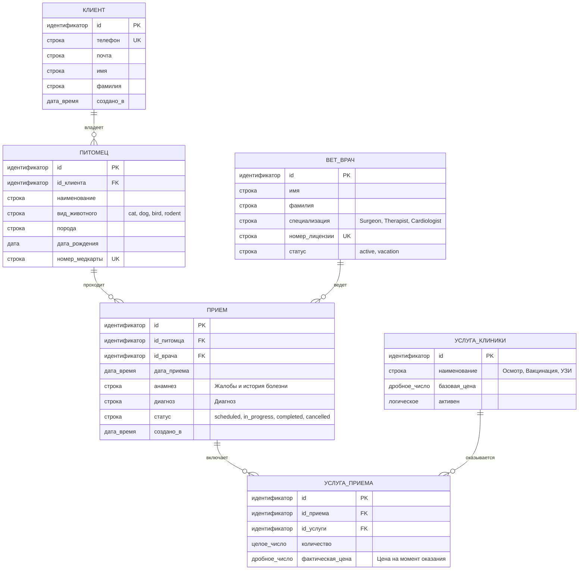

# 📊 Проектирование базы данных (ER-модель)

Ниже представлена логическая структура реляционной базы данных для информационной системы ветеринарной клиники, описывающая учет медицинских карт, назначений и приемов.

### Логическая структура на русском языке

