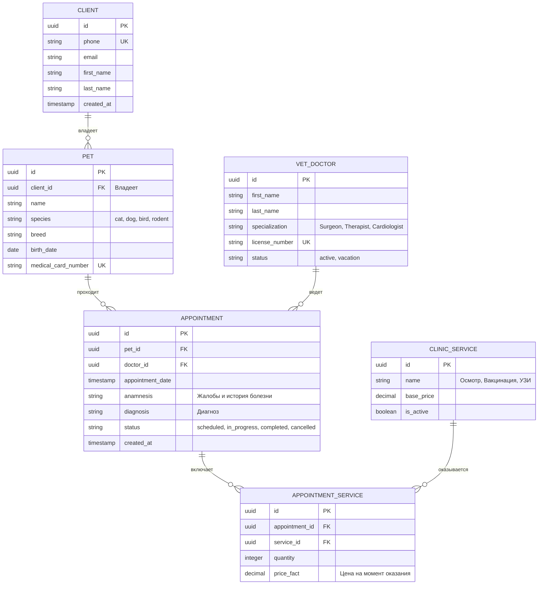

# 📂 Материалы проекта: ИС Ветеринарной клиники

Для навигации по артефактам проектирования клиники выберите соответствующий документ:

| Артефакт проектирования | Ссылка | Описание |
| :--- | :--- | :--- |
| **Контекст** | 🗺️ [Контекстная диаграмма](01-context-diagram.md) | Архитектурное окружение и интеграции |
| **Требования** | 📋 [Бизнес-требования](02-requirements.md) | Функциональные рамки информационной системы |
| **База данных** | 📊 [Модель данных ERD](03-data-model.md) | Логическое проектирование таблиц и ключей |
| **Сценарии использования** | ⚙️ [Спецификации Use Cases](04-use-cases.md) | Описание сценариев для ролевой модели |
| **Валидация** | 🧪 [План тестирования](05-testing.md) | Проверка реализации заложенной логики |
| **Контракт интеграции** | 🛠️ [REST API контракт](06-api-contract.md) | Проектирование методов, JSON схемы |
| **Взаимодействие систем** | 📐 [Sequence Diagram](07-sequence-diagram.md) | Потоки данных между сервисами клиники |

---

# 🏥 Кейс: Ветеринарная клиника

## 🎯 Задача
Проанализировать загрузку врачей и поток пациентов.

## 🛠️ Инструменты
- SQL (PostgreSQL)
- DBeaver

## 📊 Запросы
- Количество приёмов по врачам
- Среднее время ожидания
- Распределение пациентов по дням недели

## 📈 Результаты
- Выявлены часы пик
- Определены самые загруженные врачи

## 💡 Выводы
- Рекомендуется расширить штат в вечерние часы
- Внедрить запись онлайн

## 📊 Проектирование базы данных (ER-модель)
Ниже представлена логическая структура реляционной базы данных для информационной системы ветеринарной клиники, описывающая учет медицинских карт, назначений и приемов.

### 🔑 Описание архитектурных решений и связей:
1. **CLIENT (Клиенты)** и **PET (Питомцы)**: Связь `1:M` (Один-ко-многим). Один владелец может зарегистрировать в системе несколько животных.
2. **APPOINTMENT (Приемы)**: Центральная сущность логирования. Она связывает конкретное животное (`pet_id`) и лечащего врача (`doctor_id`), фиксируя дату визита, анамнез и выставленный диагноз.
3. **Реализация связи Многие-ко-Многим (`M:M`)**: На одном приеме может быть оказано несколько услуг (например: *Первичный осмотр + Забор крови + Вакцинация*). Чтобы избежать прямой связи многие-ко-многим между `APPOINTMENT` и `CLINIC_SERVICE`, спроектирована промежуточная таблица **APPOINTMENT_SERVICE**.
4. **Поле `price_fact`**: Фиксирует точную стоимость услуги в момент проведения приема. Это защищает исторические данные о выручке клиники от изменения цен в основном прайс-листе (`CLINIC_SERVICE`).

## 📄 Сценарии использования (Use Cases)

### UC-1: Регистрация и проведение приема питомца
**Действующие лица (Акторы):** Ветеринарный врач (Основной), Клиент (Вторичный).  
**Предусловия:** 
1. Врач авторизован в информационной системе клиники.
2. Питомец и его владелец (Клиент) уже зарегистрированы в базе данных.
3. Запись на прием существует в статусе `scheduled`.

**Основной успешный сценарий (Поток):**
1. Врач открывает расписание приемов на текущий день и выбирает нужную запись.
2. Система меняет статус приема с `scheduled` на `in_progress` и открывает электронную медицинскую карту (ЭМК) питомца.
3. Врач проводит осмотр животного и вносит в систему текстовое описание жалоб и симптомов (поле `anamnesis`).
4. Врач устанавливает и фиксирует в системе диагноз (поле `diagnosis`).
5. Врач выбирает из справочника `CLINIC_SERVICE` оказанные в ходе приема услуги (например, осмотр, забор крови).
6. Система автоматически рассчитывает и отображает итоговую стоимость приема на основе актуальных цен услуг.
7. Врач нажимает кнопку «Завершить прием».
8. Система сохраняет все данные, фиксирует цену услуг в таблице `APPOINTMENT_SERVICE`, переводит статус приема в `completed` и генерирует счет на оплату.

**Альтернативные сценарии:**
* **АС-1: Питомец не зарегистрирован в системе**
  * 1a. На шаге 1 врач обнаруживает, что у владельца появился новый питомец, которого нет в базе.
  * 2a. Врач нажимает кнопку «Добавить питомца» и связывает его с существующим `client_id`.
  * 3a. Врач заполняет обязательные поля (кличка, вид, порода, дата рождения).
  * 4a. Система автоматически генерирует уникальный `medical_card_number`.
  * 5a. Возврат к шагу 2 основного сценария.

* **АС-2: Отмена приема клиентом**
  * 1б. Клиент звонит или сообщает на ресепшене об отмене визита до начала осмотра.
  * 2б. Врач (или администратор) выбирает запись и нажимает «Отменить прием».
  * 3б. Система запрашивает причину отмены, меняет статус приема на `cancelled` и освобождает временной слот в расписании врача.

**Постусловия:** 
* Статус приема обновлен в базе данных.
* В медицинской карте питомца зафиксирована новая запись о приеме, доступная для просмотра другим врачам клиники.
