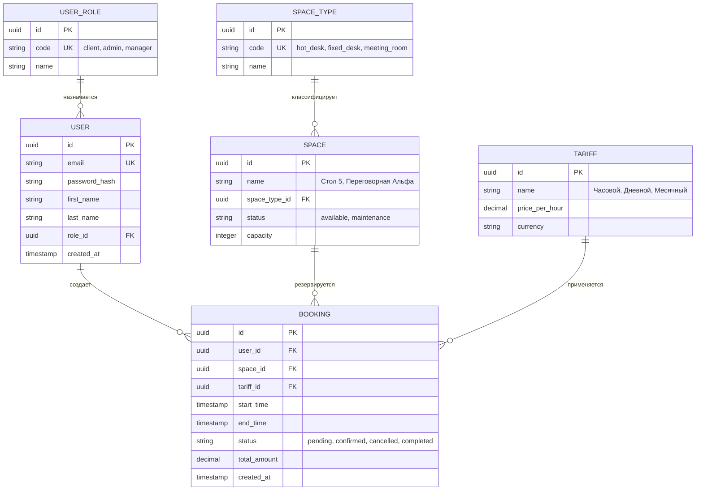

# 📂 Материалы проекта: Система бронирования коворкингов

Используйте таблицу для быстрого перехода к ключевым аналитическим разделам проекта:

| Раздел кейса | Быстрая ссылка | Описание |
| :--- | :--- | :--- |
| **Бизнес-цели** | 🎯 [#задача](#-задача) | Оптимизация использования пространства и бронирования |
| **Инструментарий** | 🛠️ [#инструменты](#-инструменты) | Стек аналитика: SQL (PostgreSQL), DBeaver |
| **Аналитика и SQL** | 📊 [#запросы](#-запросы) | Метрики: загрузка помещений, популярность мест, отток клиентов |
| **Результаты** | 📈 [#результаты](#-результаты) | Построенные дашборды, выводы и бизнес-решения |

---

# 🏢 Кейс: Коворкинг-центр

## 🎯 Задача
Оптимизировать использование пространства и бронирования.

## 🛠️ Инструменты
- SQL (PostgreSQL)
- DBeaver

## 📊 Запросы
- Загрузка помещений по часам
- Популярность типов рабочих мест
- Отток клиентов

## 📈 Результаты
- Построен дашборд загрузки
- Выявлены самые востребованные зоны

## 💡 Выводы
- Ввести гибкую систему бронирования
- Добавить больше переговорных комнат

## 📊 Проектирование базы данных (ER-модель)
Ниже представлена логическая структура базы данных системы бронирования коворкинга, описывающая связи между пользователями, рабочими зонами, тарифами и сессиями бронирования.

### 🔑 Описание ключевых сущностей и связей:
1. **USER (Пользователи)** и **USER_ROLE (Роли)**: Связь `1:M`. Ролевая модель вынесена в отдельный справочник для масштабируемости ролевой модели, `technician`).
2. **SPACE (Рабочие пространства)** и **SPACE_TYPE (Типы зон)**: Связь `1:M`. Разделяет логику тарификации и вместимости для обычных столов (Hot Desk) и полноценных переговорных комнат.
3. **BOOKING (Бронирования)**: Центральная таблица фактов. Реализует связь через внешние ключи (`FK`) ко всем справочникам, фиксируя точные временные интервалы, финальную стоимость (`total_amount`) и статусы жизненного цикла брони.
