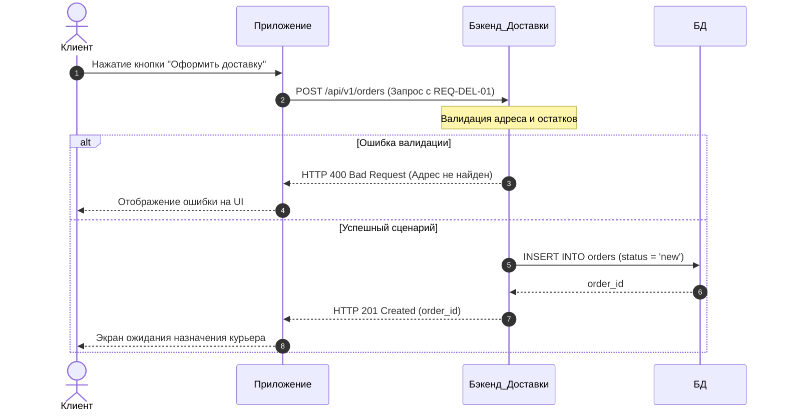

# Диаграмма последовательности: Создание заказа на доставку

```mermaid
sequenceDiagram
    autonumber
    actor Клиент
    participant Приложение
    participant Бэкенд_Доставки
    participant БД

    Клиент->>Приложение: Нажатие кнопки "Оформить доставку"
    Приложение->>Бэкенд_Доставки: POST /api/v1/orders (Запрос с REQ-DEL-01)
    Note over Бэкенд_Доставки: Валидация адреса и остатков
    alt Ошибка валидации
        Бэкенд_Доставки-->>Приложение: HTTP 400 Bad Request (Адрес не найден)
        Приложение-->>Клиент: Отображение ошибки на UI
    else Успешный сценарий
        Бэкенд_Доставки->>БД: INSERT INTO orders (status = 'new')
        БД-->>Бэкенд_Доставки: order_id
        Бэкенд_Доставки-->>Приложение: HTTP 201 Created (order_id)
        Приложение-->>Клиент: Экран ожидания назначения курьера
    end
```
