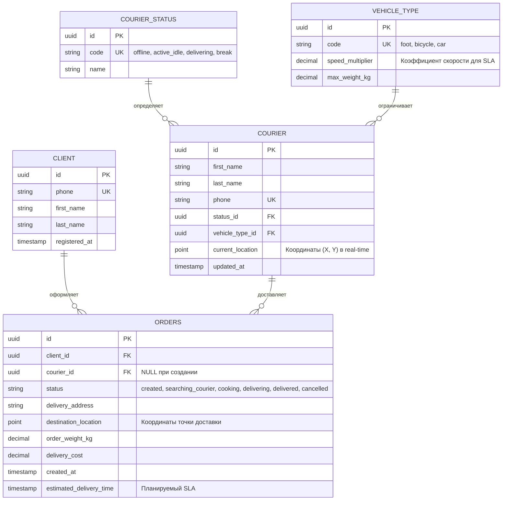

# 📂 Материалы проекта: Автоматизация логистики и доставки

Используйте таблицу для быстрого изучения системных артефактов сервиса доставки:

| Артефакт проектирования | Ссылка | Описание |
| :--- | :--- | :--- |
| **Проблематика** | 🔍 [Анализ корневой проблемы](01-true-problem.md) | Исследование "узких мест" текущей логистики |
| **Пользовательские сценарии** | 📋 [User Stories & Критерии](02-user-story.md) | Декомпозиция фич, приёмка (Acceptance Criteria) |
| **Архитектура потоков** | 📐 [Sequence Diagram](03-sequence-diagram.md) | Диаграмма вызовов при обработке доставки |
| **Интеграционный контракт** | 🛠️ [Спецификация API](04-api-spec.md) | Контракт взаимодействия со службами доставки |

---

# 🚚 Кейс: Доставка и логистика

## 🎯 Задача
Анализ результативности доставки и маршрутов.

## 🛠️ Инструменты
- SQL (PostgreSQL)
- Python

## 📊 Запросы
- Среднее время доставки
- Загрузка курьеров
- Географическое распределение заказов

## 📈 Результаты
- Выявлены проблемные зоны
- Построена карта доставки

## 💡 Выводы
- Оптимизировать маршруты в часы пик
- Добавить курьеров в южный кластер

## 📊 Проектирование базы данных (ER-модель)
Ниже представлена логическая структура базы данных бэкенда логистической платформы, обеспечивающая координацию заказов, клиентов и курьерской службы.

### 🔑 Ключевые архитектурных решения:
1. **Динамический `ORDERS.courier_id`**: Поле инициализируется как `NULL`. Идентификатор курьера присваивается строке базы данных только после успешного прохождения алгоритма распределения.
2. **Тип данных `point`**: Использование пространственных координат для `current_location` и `destination_location` позволяет выполнять легковесные гео-запросы (например, расчет расстояния по формуле гаверсинуса) на уровне СУБД.

---

## 📄 Сценарии использования (Use Cases)

### UC-1: Автоматическое назначение курьера на заказ
**Действующие лица (Акторы):** Информационная система (Основной), Курьер (Вторичный).  
**Предусловия:** Заказ успешно оплачен клиентом, имеет статус `searching_courier`. На линии есть курьеры в статусе `active_idle`.

**Основной успешный сценарий (Поток):**
1. Система сканирует таблицу `ORDERS` и находит заказы со статусом `searching_courier`.
2. Система выполняет пространственный гео-запрос к таблице `COURIER`, фильтруя исполнителей по условиям: `status_id = 'active_idle'` и `max_weight_kg >= order_weight_kg`.
3. Система сортирует подходящих курьеров по дистанции от их `current_location` до адреса ресторана/склада сборки заказа.
4. Система выбирает ближайшего курьера и отправляет ему push-уведомление в курьерское приложение с деталями заказа и таймером принятия (60 секунд).
5. Курьер нажимает кнопку «Принять заказ» в своем приложении.
6. Система блокирует курьера: меняет его статус в таблице `COURIER` на `delivering`.
7. Система обновляет запись в `ORDERS`: прописывает `courier_id` выбранного сотрудника и переводит статус заказа в `cooking` (или `delivering`, если заказ уже собран).

**Альтернативные сценарии:**
* **АС-1: Тайм-аут или отказ курьера**
  * 5a. Курьер нажимает «Отклонить» или игнорирует push-уведомление в течение 60 секунд.
  * 6a. Система исключает данного курьера из пула кандидатов для *этого конкретного* заказа на следующие 10 минут.
  * 7a. Возврат к шагу 3 для выбора следующего ближайшего курьера из отсортированного списка.
* **АС-2: Свободные курьеры отсутствуют**
  * 2б. Система не находит ни одного курьера в статусе `active_idle` в радиусе зоны доставки.
  * 3б. Система оставляет заказ в статусе `searching_courier`, увеличивает радиус поиска в гео-запросе и планирует повторный запуск сценария через 30 секунд.
  * 4б. Если курьер не найден в течение 15 минут, система отправляет уведомление диспетчеру для ручного распределения или изменения SLA.
