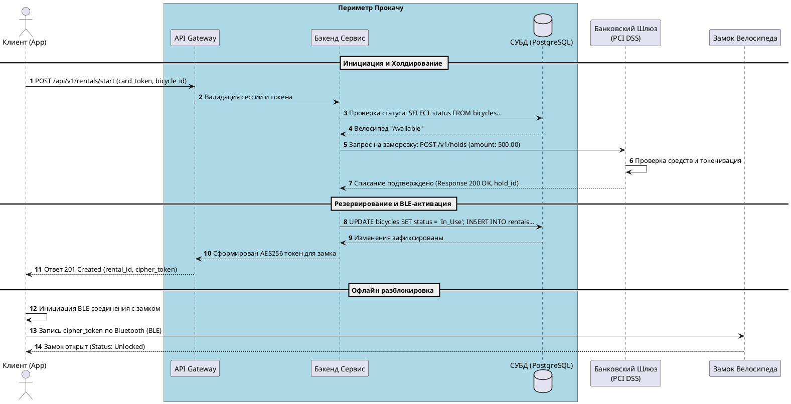

# 🛠️ Техническая спецификация: SQL & API Контракты «Прокачу»

---

## 🗄️ Часть 1. Сложные SQL-скрипты для DBeaver

### Скрипт 1. Мониторинг аномалий и зависших аренд (Отчет для Анны)
*   **Бизнес-цель**: Найти активные поездки, которые длятся более 3 часов (180 минут). Это маркер того, что у пользователя сессия не закрылась автоматически из-за сбоя GPS или заклинивания замка.
*   **SQL-запрос (PostgreSQL / MySQL)**:
```sql
SELECT 
    r.id AS rental_id,
    u.id AS user_id,
    u.fio AS user_name,
    u.phone AS user_phone,
    r.bicycle_id,
    r.start_time,
    TIMESTAMPDIFF(MINUTE, r.start_time, NOW()) AS duration_minutes,
    r.status AS rental_status
FROM rentals r
JOIN users u ON r.user_id = u.id
WHERE r.status = 'Active' 
  AND r.start_time < DATE_SUB(NOW(), INTERVAL 3 HOUR)
ORDER BY r.start_time ASC;
```

### Скрипт 2. Аналитика популярности и доходности станций (Отчет для Руководителя)
*   **Бизнес-цель**: Посчитать количество стартов аренд и общую выручку по каждой из 20 станций за последние 30 дней для оптимизации распределения велосипедов курьерами-механиками.
*   **SQL-запрос**:
```sql
SELECT 
    s.id AS station_id,
    s.address AS station_address,
    COUNT(r.id) AS total_rentals_count,
    SUM(r.final_amount) AS total_revenue_rub,
    ROUND(AVG(r.final_amount), 2) AS average_check_rub
FROM stations s
LEFT JOIN rentals r ON s.id = r.start_station_id
WHERE r.end_time >= DATE_SUB(NOW(), INTERVAL 30 DAY)
   OR r.id IS NULL
GROUP BY s.id, s.address
ORDER BY total_revenue_rub DESC, total_rentals_count DESC;
```

---

## 🌐 Часть 2. REST API Контракт: Старт аренды (Swagger / OpenAPI)

*   **Метод**: `POST`
*   **Эндпоинт**: `/api/v1/rentals/start`
*   **Описание**: Инициирует аренду, проверяет доступность велосипеда, замораживает (холдирует) депозит 500 рублей на карте по PCI DSS и возвращает токен для BLE-разблокировки замка в офлайне.

### JSON-запрос от мобильного приложения (Request Body)
```json
{
  "user_id": 1024,
  "bicycle_id": 4502,
  "start_station_id": 14,
  "payment_method": {
    "type": "card_token",
    "card_token": "tok_pci_dss_98237482937492"
  },
  "client_device": {
    "os": "iOS",
    "os_version": "17.4",
    "app_version": "1.0.0"
  }
}
```

### Успешный JSON-ответ от бэкенда (Response 201 Created)
```json
{
  "rental_id": 78912,
  "status": "Active",
  "start_time": "2026-07-16T11:00:00Z",
  "hold_deposit": {
    "amount": 500.00,
    "currency": "RUB",
    "transaction_id": "tx_hold_776152"
  },
  "offline_ble_unlock": {
    "ble_service_uuid": "0000180a-0000-1000-8000-00805f9b34fb",
    "ble_characteristic_uuid": "00002a29-0000-1000-8000-00805f9b34fb",
    "unlock_cipher_token": "AES256_XYZ_892374982374892374"
  }
}
```

### Ошибочный JSON-ответ (Response 409 Conflict — Велосипед занят/забронирован)
```json
{
  "error_code": "BICYCLE_ALREADY_ENGAGED",
  "message": "Этот велосипед уже арендуется другим пользователем или находится в режиме бронирования.",
  "timestamp": "2026-07-16T11:00:02Z",
  "suggested_actions": [
    "REFRESH_MAP_PINS"
  ]
}
```

---

## 📈 Часть 3. Sequence Диаграмма (Код PlantUML)
*   **Процесс**: Холдирование депозита и старт аренды.
*   **Инструкция**: Скопируйте этот код и вставьте в любой PlantUML-редактор (или ИИ-генератор) для получения графической схемы.


